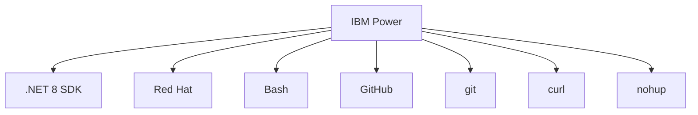

# DotNet-IBMPower
Apresentação sobre o uso de .NET com IBM Power

## Tecnologias utilizadas



## Exemplo prático

Comando para instalar o .NET 8:

```bash
sudo dnf install dotnet-sdk-8.0
```

Referência: [**Install the .NET SDK or the .NET Runtime on RHEL and CentOS Stream**](https://learn.microsoft.com/en-us/dotnet/core/install/linux-rhel)

Repositório para clonar: **https://github.com/renatogroffe/ASPNETCore8-MinimalAPIs-AppInsights-Containers_ContagemAcessos**

Build da aplicação (a partir do diretório **/src/APIContagem**):

```bash
dotnet publish APIContagem.csproj -c Release -o app
```

Executar o processo em background:

```bash
nohup dotnet APIContagem.dll > ../../logs-rest-api.txt 2>&1 &
```

Exibir logs:

```bash
cat logs-rest-api.txt
```

Testes com a API de contagem de acessos:

```bash
curl http://localhost:5000/contador -w "\n"
```

Exibir conteúdo 

Encerrar o processo criado com **nohup** (**diretório /app**) - informar o número:

```bash
kill PID
```
